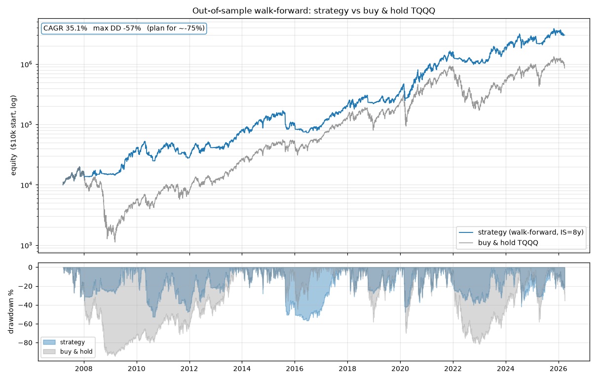
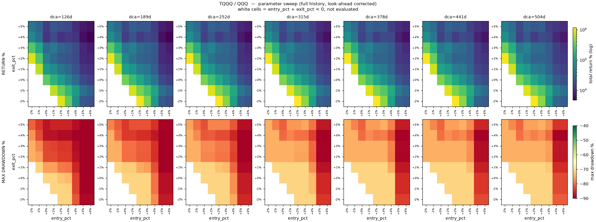
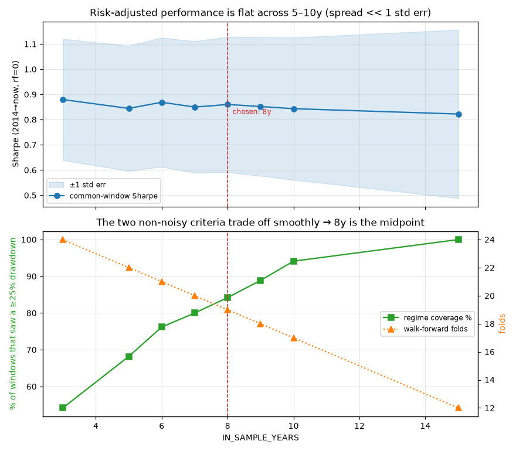

# Leveraged MA200 Strategy

A trend-following strategy that holds a 3x leveraged ETF while its underlying
index trades above its 200-day moving average, and dollar-cost-averages back
into the unleveraged index when it doesn't — plus the research that validates
it and a daily advisor that tells you what to do next.

The repo is the full arc: raw data → strategy → bias correction → walk-forward
validation → parameter selection → live tool.



*Out-of-sample walk-forward (`IN_SAMPLE_YEARS = 8`) vs buy & hold TQQQ. ~35%
CAGR, −57% realized max drawdown — plan for ≈ −75%. [More figures below.](#figures)*

---

## The strategy

A four-state machine driven by **QQQ's close relative to its 200-day SMA**.
Positions are held in **TQQQ** (3x) or **QQQ** (1x).

| State | Holding | Transition |
|---|---|---|
| `CASH` | cash | close > SMA × (1 + `entry_pct`) → all-in TQQQ |
| `FULL_LEV` | TQQQ | close < SMA × (1 − `exit_pct`) → sell all, begin DCA |
| `DCA` | cash draining into QQQ | buys 1/N of remaining cash per day for `dca_days`; early exit to TQQQ if close > entry trigger |
| `DELEVERAGED` | QQQ | close > entry trigger → all-in TQQQ |

Three parameters — `entry_pct`, `exit_pct`, `dca_days` — are **not fixed**.
They are re-chosen every year by walk-forward optimization on the trailing
8 years (see [Choosing the in-sample window](#choosing-the-in-sample-window)).

The asymmetric buffers matter: entering requires clearing the SMA by a margin,
exiting requires falling below it by a different margin. The gap suppresses
whipsaw around the average. The grid enforces `entry_pct + exit_pct >= 0` so
the entry trigger can never sit below the exit trigger.

**Decide on the close, trade at the next open.** Every backtest and the live
tool follow this convention — see [Look-ahead bias](#look-ahead-bias).

---

## Layout

```
data/        price CSVs — raw Yahoo downloads + synthetic pre-inception extensions
research/    the numbered pipeline, 01 → 12, in the order it was built
live/        daily_advisor.py — the operational tool
results/     generated CSVs (sweep grids + in-sample analysis)
figures/     committed PNGs, regenerated by research/12_make_figures.py
```

Every research script resolves `data/`, `results/`, and `figures/` relative to
the repo root, so you can run them from any working directory:

```bash
python research/11_insample_riskadjusted.py
```

---

## Figures

Regenerate all four with `python research/12_make_figures.py` (pure matplotlib,
no browser).

### Strategy vs buy & hold — out-of-sample walk-forward (`IN_SAMPLE_YEARS = 8`)


The strategy compounds faster than buy-and-hold TQQQ *and* clips the deep
drawdowns — every 2008/2020/2022 leg-down is shallower on the blue line. The
2015–2017 exception is the asymmetric buffer whipsawing sideways while price
chopped around the SMA. Headline: ~35% CAGR, −57% realized max drawdown —
**but plan for ≈ −75%** (see below).

### Parameter sweep — `entry_pct × exit_pct` per `dca_days`



Full-history backtest of every grid cell (look-ahead corrected). Return is
highest along the lower-left diagonal (low/negative `exit_pct` = quicker to
bail); drawdown worsens sharply toward high `entry_pct` (top-right). `dca_days`
barely moves either surface — the DCA length is a second-order knob. White
cells are `entry_pct + exit_pct < 0`, not evaluated. This is in-sample and
descriptive — it is *not* how parameters are chosen (that's the walk-forward).

### In-sample window choice



Top: risk-adjusted performance is flat from 5–10 years — the whole spread fits
inside one standard-error band. Bottom: the two criteria that *aren't* noise
(regime coverage, fold count) trade off smoothly, and **8 years** is the
midpoint. Full reasoning in
[Choosing the in-sample window](#choosing-the-in-sample-window).

---

## The pipeline

### Data (01–04)

Leveraged ETFs are young — TQQQ launched in 2010, SPXL in 2008 — which leaves
too little history to walk-forward honestly. Scripts `02`–`04` **synthesize
pre-inception series** by applying leverage and drag to the underlying's daily
returns:

```
synthetic_return = leverage × underlying_return − (expense_ratio + financing_spread) / 252
```

then anchoring backward from the real inception price and splicing. TQQQ and
QLD extend from QQQ; SPXL and SSO from SPY. Expense ratios are the real ones
(~0.91–0.95%) plus a ~1%/yr financing spread estimate.

This is a **model, not data.** It reproduces the daily-reset compounding
mechanics but not tracking error, borrowing-cost regime changes, or the
liquidity conditions of 2000 and 2008. The extended series is used only for
parameter optimization; treat pre-2010 results as directional.

### Strategy and sweeps (05–06)

`05` runs the baseline and compares 2x (QLD/SSO) against 3x (TQQQ/SPXL).
`06` sweeps the full `entry_pct × exit_pct × dca_days` grid — and is the
**bias-corrected** version; see below.

### Validation (07–11)

| Script | Question |
|---|---|
| `07_walkforward_cost_sensitivity` | Does the edge survive 0/2/5/10/20 bps of trading cost? The DCA state trades daily, so cost exposure is easy to undercount. |
| `08_monte_carlo` | Two layers: a cheap block bootstrap of realized returns (sequence risk), and a nested MC that rebuilds synthetic QQQ/TQQQ price paths and **re-runs the entire optimization** on each (parameter-selection risk). |
| `09_dca_shapes` | Should the DCA be linear, front-loaded, back-loaded, or dip-scaled (buy more when price has fallen further)? Includes a dip-sensitivity sweep. |
| `10_insample_window` | How long should the optimization window be? Walk-forward → efficiency → regime coverage → MC, for 3/5/7/10/15 years. |
| `11_insample_riskadjusted` | The same question with Sharpe/Sortino/Calmar, and corrected for a period confound `10` misses. Writes `results/insample_sharpe_cagr.csv`. |
| `12_make_figures` | Renders every PNG in `figures/` from committed data + results. |

---

## Look-ahead bias

An early version of the sweep decided on a bar's close and filled at the same
bar. That is unimplementable — you cannot trade a price you are still waiting
to observe. Every script here uses the corrected form:

```python
s_close_lagged = signal_close.shift(1)     # decide on yesterday's close
s_sma_lagged   = signal_sma.shift(1)       # and yesterday's SMA
... fills at leveraged_open[i] / fallback_open[i]     # trade at today's open
```

The pre-fix sweep outputs are deliberately **not** in `results/` — they
overstate returns and would mislead anyone reading this repo.

A second, subtler point: the 200-day SMA is computed **once over the full
series and then sliced per window**, never recomputed inside each window.
Recomputing would blank the first 200 days of every fold. Slicing is correct
and not leakage — on any given day, the trailing 200-day average is genuinely
known.

---

## Walk-forward, and what a fold is

The timeline is cut into repeated train → test cycles. One **fold**:

1. Grid-search parameters on an in-sample window of `IN_SAMPLE_YEARS`
2. Freeze them, trade the **next 1 year** (out-of-sample, unseen)
3. Slide forward one year, repeat

The 1-year out-of-sample slices are stitched into one equity curve, and
**positions carry across the seam** — cash, shares, state, and DCA counter all
continue. Only the parameters swap.

The optimizer does not take the single best-scoring cell. It scores every combo
by `return / |max drawdown|`, then picks the cell whose **local neighborhood**
(adjacent entry/exit/dca values) averages best — a plateau, not a spike, on the
theory that an isolated peak is fitted noise.

Because the leading in-sample block is consumed as training only, **each extra
year of window costs one fold**, and the out-of-sample track starts later.

---

## Choosing the in-sample window

`10` and `11` sweep `IN_SAMPLE_YEARS ∈ {3, 5, 6, 7, 8, 9, 10, 15}`.

Naively, shorter looks better — 3 years produced ~600,000% total return versus
15 years' ~2,800%. **That comparison is invalid.** A shorter window makes the
out-of-sample track *start earlier*, so it is both longer (24y vs 12y) and
richer in favorable years. `11` fixes this by also evaluating every candidate on
the window they all share (2014→present):

| IS yrs | folds | regime coverage | common Sharpe | common CAGR | common max DD | common Calmar |
|---|---|---|---|---|---|---|
| 3 | 24 | 54% | 0.880 | 35.9% | −50.7% | 0.708 |
| 5 | 22 | 68% | 0.845 | 33.4% | −56.7% | 0.589 |
| 6 | 21 | 76% | 0.869 | 34.9% | −52.2% | 0.670 |
| 7 | 20 | 80% | 0.850 | 33.7% | −56.0% | 0.602 |
| **8** | **19** | **84%** | **0.860** | **34.4%** | **−56.7%** | **0.606** |
| 9 | 18 | 89% | 0.852 | 33.8% | −56.7% | 0.596 |
| 10 | 17 | 94% | 0.843 | 33.3% | −56.7% | 0.586 |
| 15 | 12 | 100% | 0.822 | 32.4% | −56.5% | 0.574 |

**Risk-adjusted performance cannot decide this.** Over a 12-year sample the
standard error on a Sharpe of ~0.85 is ≈0.34. The entire spread from IS=5 to
IS=10 (0.843→0.869) is under a tenth of one standard error. The 5→6→7→8→9
wiggle is sampling noise.

So the choice rests on the two columns that **aren't** noise, both deterministic
counts rather than performance estimates:

- **Regime coverage** — the share of optimization windows that had actually
  lived through a ≥25% QQQ drawdown before parameters were picked. If a
  training window never contained a crash, nothing ever punished aggressive
  parameters, and the next out-of-sample year may be the crash that does.
- **Fold count** — how many independent "did it generalize?" tests back the
  result.

These trade off smoothly with no sweet spot, so **8 years** is chosen as the
honest midpoint: 84% coverage, 19 folds. 7 and 9 give a near-identical strategy;
3 optimizes half-blind (54%); 15 spends too much history on training.

Efficiency (out-of-sample ÷ in-sample return) exceeds 100% at every setting,
so it does not discriminate either.

---

## The drawdown number that matters

Realized max drawdown across settings is ≈ **−57%**. The block-bootstrap Monte
Carlo in `10` puts that at only the **~13th percentile** of resampled alternate
histories — the backtest drew a *lucky* drawdown, and −57% is not a ceiling.

The honest planning number is the bootstrap's 25th percentile: **≈ −75%**.

Annualized volatility is ~48% regardless of window choice. This is a 3x
leveraged strategy and it behaves like one.

---

## Live advisor

```bash
cd live
python daily_advisor.py
```

Run once per trading day after the 16:00 ET close. It refreshes data, replays
the state machine to determine your position, re-optimizes when a year has
elapsed, and prints the next move — **including how far price sits from the
200-day SMA in percent**, plus the 5-day change in that gap.

```
  MARKET  (QQQ)
    close ....................       716.76
    200-day SMA .............       654.68
    price vs SMA ............       +9.48%   ABOVE   (5 sessions ago: +8.30%  ->  +1.18 pts)

  ACTIVE PARAMETERS   (walk-forward re-opt as of 2026-03-30)
    entry buffer ...........         +4%   -> enter trigger      680.87   (+5.27% vs close)
    exit buffer ............         -2%   -> exit trigger       667.77   (+7.34% vs close)
    DCA length .............      189 d

  POSITION
    tracked state .......... FULL_LEV
    currently holding ...... TQQQ

  NEXT MOVE   (execute at the next session's open)
    HOLD TQQQ.
         Exit only if QQQ CLOSES below 667.77 (cushion +7.34% right now).
```

Parameter history is cached in `advisor_state.json`, so normal days run in ~1
second and only the annual re-optimization is slow. Full flag reference in
[live/README.md](live/README.md).

---

## Setup

```bash
pip install -r requirements.txt
```

`pandas_ta_classic` is optional — only scripts `05`–`09` import it, for
`ta.sma`. Scripts `10`–`12` and the live advisor use plain
`Series.rolling(200).mean()` and have no such dependency. `matplotlib` (for
`12`) and `plotly` (for the browser charts in `05`, `06`, `08`) are in
`requirements.txt`.

Regenerating data requires network access (`yfinance`). The CSVs in `data/` are
committed so the research scripts run offline.

---

## Reproducing

```bash
python research/02_extend_tqqq.py              # refresh + extend TQQQ
python research/06_parameter_sweep_nolookahead.py   # -> results/sweep_*_nolookahead.csv
python research/10_insample_window.py          # ~2 min, prints to stdout
python research/11_insample_riskadjusted.py    # ~3 min -> results/insample_sharpe_cagr.csv
python research/12_make_figures.py             # ~1 min -> figures/*.png
```

Scripts `05`, `06`, and `08` also open interactive Plotly figures in a browser;
the multi-MB HTML they save is gitignored — regenerate locally. The committed
`figures/*.png` come from `12` only.

---

## Open threads

Not concluded in this repo — the scripts exist, the answers haven't been
written down:

- **Trading costs** (`07`) — the DCA state trades every day, so the daily drip
  is where cost sensitivity would bite. Run the 0/2/5/10/20 bps sweep and
  record the result.
- **DCA shape** (`09`) — linear is what's implemented; front-loaded,
  back-loaded, and dip-scaled are coded but the comparison isn't settled.
- **Nested Monte Carlo** (`08`) — defaults to 30 sims because each one re-runs
  a full grid-search walk-forward. Scale it up for a usable distribution.
- **2x vs 3x** (`05`) — QLD/SSO variants are built but the leverage choice was
  never revisited after the bias fix.

---

## Disclaimer

Personal research. Not investment advice. Backtested results are not predictive,
the pre-inception data is modelled rather than observed, and a strategy with
~48% annualized volatility and a plausible −75% drawdown is not suitable for
capital you need.
